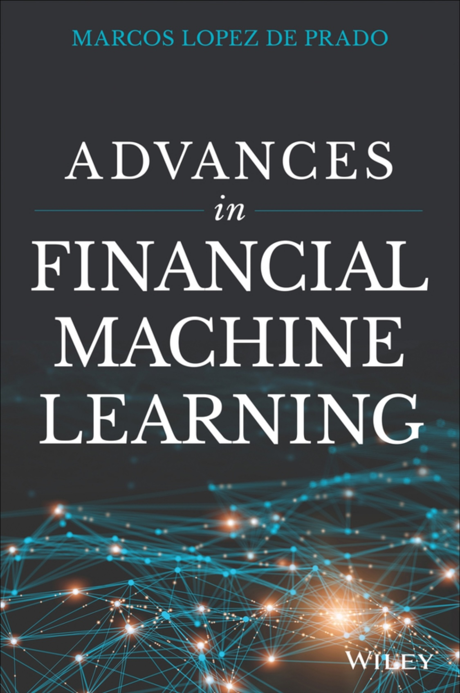

# Advances In Financial Machine Learning

> This repository contains exercise solutions and code snippets from the book "Advances in Financial Machine Learning" by Marcos Lopez de Prado.

## Table of Contents

- [Introduction](#introduction)
- [Directory Structure](#directory-structure)
- [Installation](#installation)
- [Usage](#usage)
- [License](#license)
- [Contact](#contact)

## Introduction

This repository provides a collection of solutions to the exercises and code snippets presented in Marcos Lopez de Prado's "Advances in Financial Machine Learning." It is intended to help readers understand and implement the concepts discussed in the book.

## Directory Structure

The repository is organized by chapter, with each directory named according to the convention `chapter_N`.

Each chapter directory contains the following:

-   `exercise.ipynb`: Jupyter Notebook containing solutions to the chapter's exercises.
-   `snippet.ipynb`: Jupyter Notebook containing code snippets from the chapter.
-   `*.py`: Python files containing helper functions used in the notebooks.

Example:

    bash
    git clone https://github.com/Green-grape/AFML.git
    cd AFML

    > **Note:** Ensure you have Jupyter Notebook installed to run the `.ipynb` files. If not, install it with `pip install notebook`. You may also need to install specific data science libraries. It's recommended to create a `requirements.txt` file with common libraries such as `numpy`, `pandas`, `scikit-learn`, and `matplotlib` to install all dependencies using `pip install -r requirements.txt`.

    jupyter notebook exercise.ipynb

    > **Note:** Some notebooks may require specific data files. Ensure these are available in the appropriate directories or download them as instructed in the book.

## License

This project is licensed under the MIT License - see the [LICENSE](LICENSE) file for details.

## Contact

> Juho Kim - [Gmail](juho13729@gmail.com)